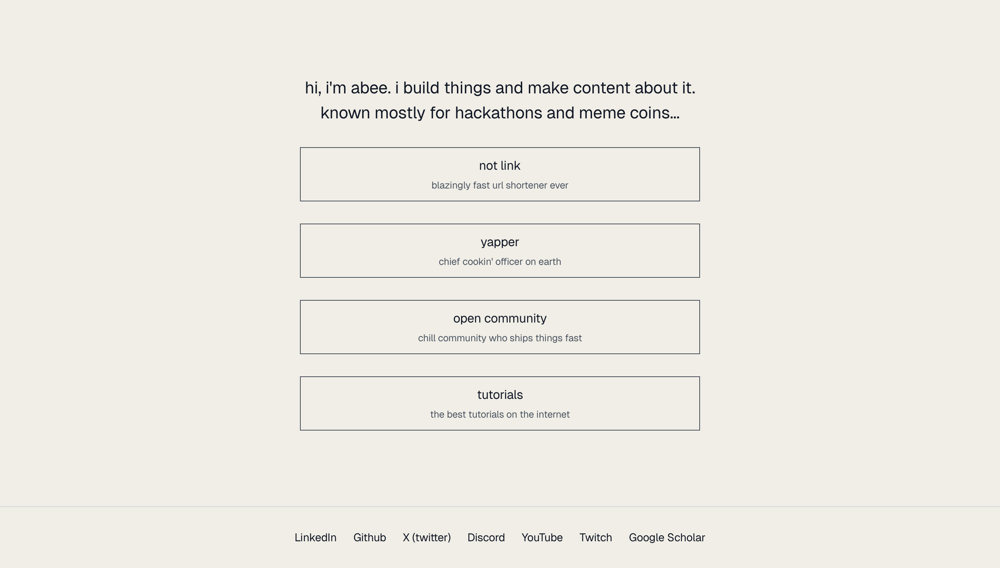

#  yats – yet another theo starter

you like [theo's](https://t3.gg) personal website, so i made this boilerplate for you.

build theo's like stuff in less than a minute.

this is mainly maintained for me and by me, feel free to remix/use it as you see fit.

## setup

```sh
git clone https://github.com/abdibrokhim/yaps.gg ./yats
cd yats
```

install.

```sh
npm install
```

next, i recommend you go to `src/app/page.tsx` and `src/components/footer.tsx`. find `const stuff = [{...}]` and replace it with your own stuff.

## development

here are some neat commands you can run:

```sh
# dev
npm run dev
```

open `http://localhost:3000` in your browser.

here's an example.


